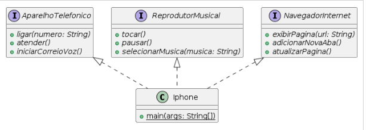

<!-- @format -->

# Diagrama de Classes: Interfaces e Classe Iphone

## Interfaces

### AparelhoTelefonico

- **Métodos abstratos:**
  - `ligar(numero: String)`
  - `atender()`
  - `iniciarCorreioVoz()`

### ReprodutorMusical

- **Métodos abstratos:**
  - `tocar()`
  - `pausar()`
  - `selecionarMusica(musica: String)`

### NavegadorInternet

- **Métodos abstratos:**
  - `exibirPagina(url: String)`
  - `adicionarNovaAba()`
  - `atualizarPagina()`

## Classe Iphone

A classe `Iphone` implementa as seguintes interfaces:

- `ReprodutorMusical`
- `AparelhoTelefonico`
- `NavegadorInternet`

### Métodos

- **`main(args: String[])`:**
  - Método estático para iniciar o programa e testar as funcionalidades do iPhone.

```java
public class Iphone implements ReprodutorMusical, AparelhoTelefonico, NavegadorInternet {
    // Implementações dos métodos das interfaces...
}


The `JAVA PROJECTS` view allows you to manage your dependencies. More details can be found [here](https://github.com/microsoft/vscode-java-dependency#manage-dependencies).

```
